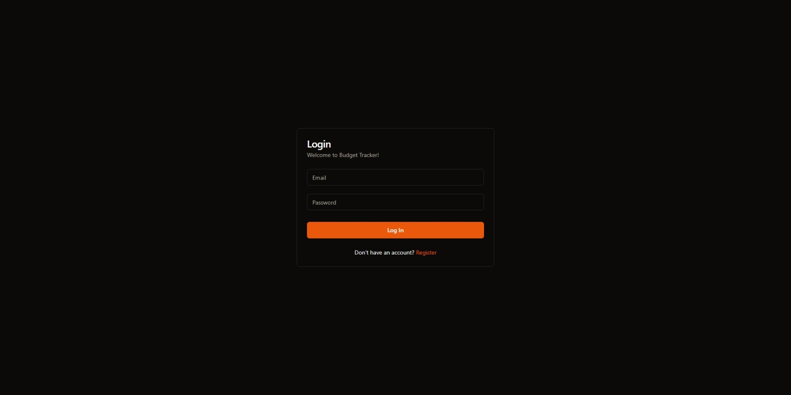
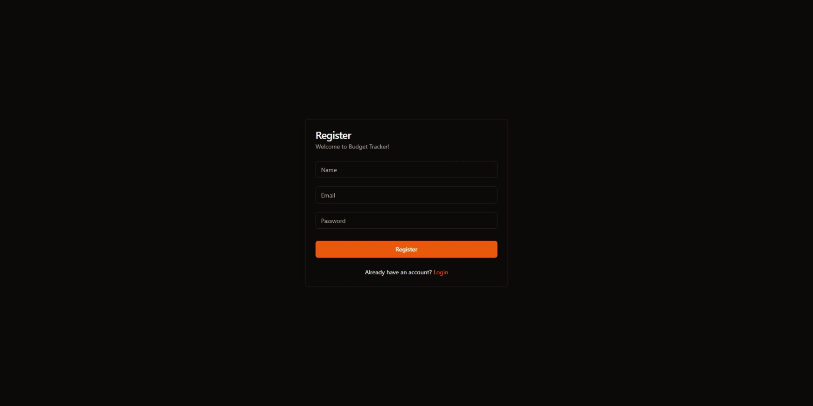
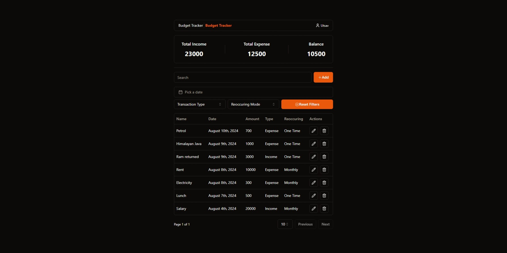

# Budget Tracker

The budget tracker application consists of three different base pages as follows:

1. Login
   

   The login page is the first page that the user will see when they visit the application. The user can enter their email and password to log in to the application. If the user does not have an account, they can click on the `Register` link to create a new account.

2. Register
   

   The register page allows the user to create a new account by entering their email, password, and name. After the user has entered the required information, they can click on the `Register` button to create the account. Once the account has been created, the user will be redirected to the login page to log in to the application.

3. Dashboard
   

   The dashboard page is the main page of the application where the user can view their incomes and expenses. The user can add a new transaction by clicking on the `Add` button. The user can also filter the transactions by type, category and date range. The user can view the total income, total expense, and balance at the top of the page.

The application also includes the following features:

- User Registration and Authentication
- User Authorization
- Income and Expense Management
- Summary Statistics

The [user manual](./user-manual.md) provides detailed instructions on how to use the application.
