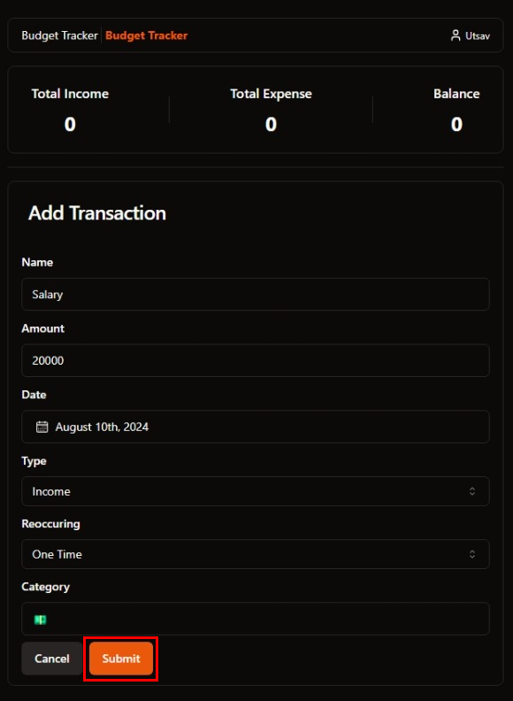
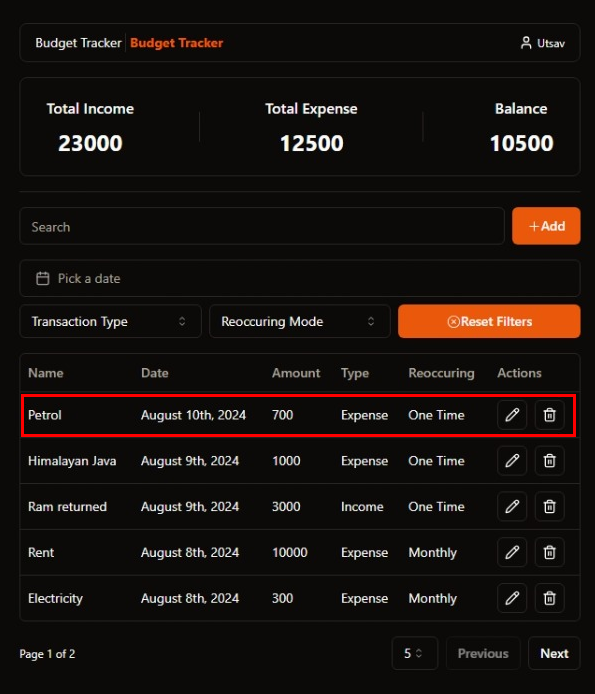
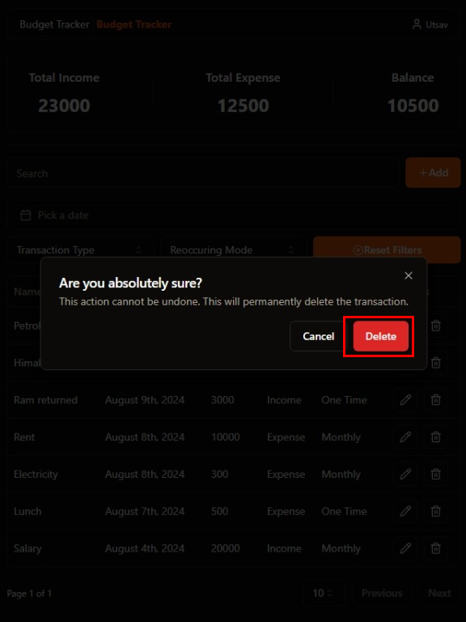

# Budget Tracker User Manual

## Table of Contents

- [User Registration](#user-registration)
- [Add Transaction](#add-transaction)
- [Edit Transaction](#edit-transaction)
- [Delete Transaction](#delete-transaction)
- [Filter Transactions](#filter-transactions)

## User Registration

Upon opening the application, the user is presented with a login page where they can enter their email and password to log in to the application. If the user does not have an account, they can click on the `Register` link to create a new account.

1. Click on the `Register` link to navigate to the register page.

   

2. Enter your email, password, and name in the input fields provided.

   

3. Click on the `Register` button to create the account and you will be automatically logged in to the application.

   

## Add Transaction

In the dashboard page, the user can add a new transaction by clicking on the `Add` button.

1. Click on the `Add` button to open the transaction form.

   

2. Enter the transaction details such as type, category, amount, and date in the input fields provided.

   

3. Click on the `Submit` button to add the transaction to the list.

   

4. The transaction will be added to the list and the total income, total expense, and balance will be updated accordingly.

   

## Edit Transaction

In the dashboard page, the user can edit a transaction by clicking on the `Edit` button next to the transaction.

1. Click on the `Pencil` button next to the transaction that you want to edit.

   

2. Update the transaction details such as type, category, amount, and date in the input fields provided and click on the `Submit` button to save the changes.

   

3. The transaction will be updated in the list and the total income, total expense, and balance will be updated accordingly.

   

## Delete Transaction

In the dashboard page, the user can delete a transaction by clicking on the `Delete` button next to the transaction.

1. Click on the `Trash` button next to the transaction that you want to delete.

   

2. Click on the `Delete` button to confirm the deletion of the transaction.

   

3. The transaction will be removed from the list and the total income, total expense, and balance will be updated accordingly.

   

## Filter Transactions

In the dashboard page, the user can filter the transactions by type, category, and date range. The filters can be applied by selecting the desired options from the dropdown menus provided. They can be applied individually or in combination. The transactions will be updated based on the selected filters. The user can also reset the filters by clicking on the `Reset Filters` button.

### Without Filters

### With Filters

#### Type Filter

#### Reoccuring Mode Filter

#### Transaction Start Date Filter

#### Transaction Start and End Date Filter

#### Search Filter

#### All Filters

### Search + All Filters

